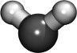

Hexadecane example
==============
This example is a simple simulation of many long alkane chains (hexadecane) in a box near the boiling point at atmospheric pressure.  The hexadecane molecule in this example (defined in the [hexadecane.lt](moltemplate_files/hexadecane.lt) file) was constructed from monomeric subunits (named "CH2", and "CH3").

#### Images

         

The number of molecules and simulation box size can be controlled by editing the [system.lt file](moltemplate_files/system.lt).  The length of each polymer can be controlled by editing the [hexadecane.lt](moltemplate_files/hexadecane.lt) file.  The simulation contitions can be controlled by editing the [run.in.npt file](run.in.npt).


### Instructions

1) To build the files which LAMMPS needs, follow the instructions in:
[README_setup.sh](README_setup.sh)

2) To run LAMMPS with these files, follow these instructions:
[README_run.sh](README_run.sh)

(The instructions in "README_remove_irrelevant_info.sh" are optional.  *(If you notice a problem with this example, please [report it](../README.md).*)


### Details

The "Hexadecane" molecule, as well as the "CH2", and "CH3" monomers it contains, use the COMPASS force-field.  As with all of the COMPASS examples, when we define these molecules, we only specify the atom names, bond list, and coordinates.  We do not have to list the atom charges, angles, dihedrals, or impropers.  The rules for creating atomic charge and angle topology are contained in the ["compass_published.lt"](../../../../moltemplate/force_fields/compass_published.lt) file.  To let moltemplate know that you want to use these rules, define your molecules (and molecular subunits) this way:

```
import "compass_published.lt"
CH2 inherits COMPASS { ... }            # (see "ch2group.lt")
CH3 inherits COMPASS { ... }            # (see "ch3group.lt")
Hexadecane inherits COMPASS { ... }     # (see "hexadecane.lt")
```


### Customizing atomic charges

In this example, atomic charge for COMPASS atoms is determined by @atom type
and bond parter *(...according to the rules in the 
["compass_published.lt"](../../../../moltemplate/force_fields/compass_published.lt) file)*.
*(Any atomic charges listed in the "Data Atoms" section of your molecules'
LT files will be ignored.)*
**These charges can be overridden.**
See [here](../README.md#Customizing-atomic-charges-in-COMPASS-molecules)
for instructions explaining how to customize atomic charge.


### Manual control of bond and angle interactions

If necessary, you can customize existing bonds, angles, dihedrals etc. in your molecule (eg. *Hexadecane*), or add new ones (if the force field does not define them).  To do this, edit the corresponding LT file (eg. ["hexadecane.lt"](./moltemplate_files/hexadecane.lt)), and add extra sections to that file (eg. *write("Data Bonds")* or *write("Data Angles")*).  Then add a list of bonded interactions to these sections (containing lines similar to *"\$bond:c7h5 @bond:CustomType \$atom:c7 \$atom:h5"*).  By default, this will override the bond and bonded angular interactions created by the force field.  For more details, read the chapter in the moltemplate manual named "Customizing molecule position and topology".)
