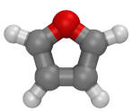
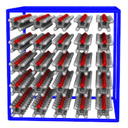
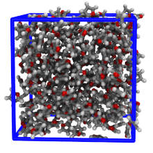

Furan example
==================
In this example, moltemplate.sh is used to create a box filled with furan molecules (defined in ["furan.lt"](moltemplate_files/furan.lt) located in "moltemplate_files").  The "furan.lt" file contains a list of atoms, their types, charges, and positions, and a list of bonds between them.  Force field parameters are generated according to the rules in the [DREIDING forcefield](https://doi.org/10.1021/j100389a010), which are stored in the ["dreiding.lt" file](../../../../moltemplate/force_fields/dreiding.lt).

### Images

    

The number of molecules and simulation box size can be controlled by editing the [system.lt file](moltemplate_files/system.lt).  The simulation contitions can be controlled by editing the [run.in.npt file](run.in.npt).


## Instructions

To create files that LAMMPS needs, enter the "moltemplate_files" subdirectory
and enter this command into the terminal:

```
moltemplate.sh system.lt
```

This will generate the following files: *"system.data"*, *"system.in.init"*, *"system.in.settings"*, which are needed to run LAMMPS.  You must copy these files to the parent directory and then follow the instructions in "README_run.sh" to run LAMMPS.


## How to create LT files for your molecule

Open the "moltemplate/furan.lt" file and study the "Data Atoms" and "Data Bond List" sections.

The choice of atom TYPES is explained in the DREIDING_label_manual.pdf, which is available [here](https://github.com/m-bone/moltemplate-DREIDING).  That repository also contains several scripts to convert XYZ files into LT files that moltemplate can read (similar to the "furan.lt" file used here).  More information is available [here](https://github.com/m-bone/moltemplate-DREIDING/blob/master/xyzToMoltemplate/README.txt).

Generally, moltemplate does not know how to calculate atomic partial charges, unless they are defined in the force field file itself.  (The DREIDING force field does not assign atom partial charges.  Automating the assignment of atom charges is an area where moltemplate could be improved.)


### WARNING: The atomic charges are not correct.

In this example, I obtained partial charge estimates from the OPLSAA parameter file located [here](http://dasher.wustl.edu/tinker/distribution/params/oplsaa.prm).)  ***DO NOT DO THIS.***  This is not how the DREIDING force field should be used.  It will probably not result in accurate behavior.

Suggestions how to choose partial charges correctly can be found [here](../README.md).


## Optional cleanup

By default, the "system.data" and "system.in.settings" files created by moltemplate.sh are quite large, containing every possible atom and interaction type defined in the DREIDING force field.  Although this extra information is harmless (and probably does not slow down the simulation significantly), you may wish to clean up these files and remove atom and bond type information you don't need.  In that case, follow the instructions in the ["README_remove_irrelevant_info.txt"](README_remove_irrelevant_info.txt) file.
