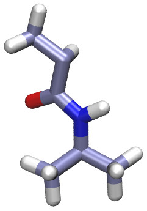
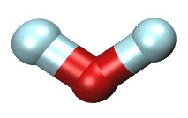
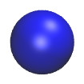
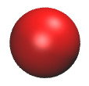
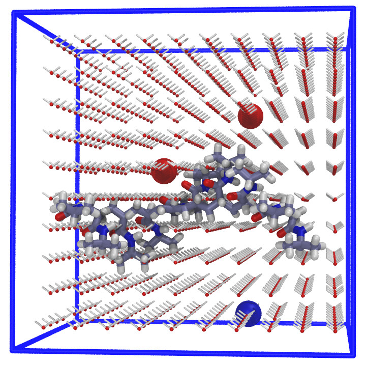
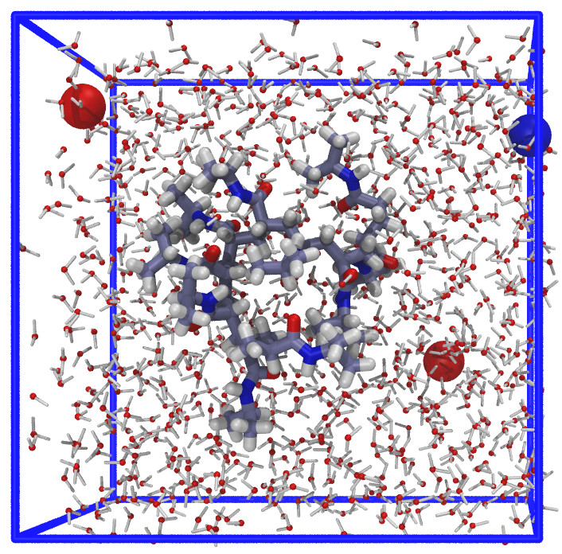
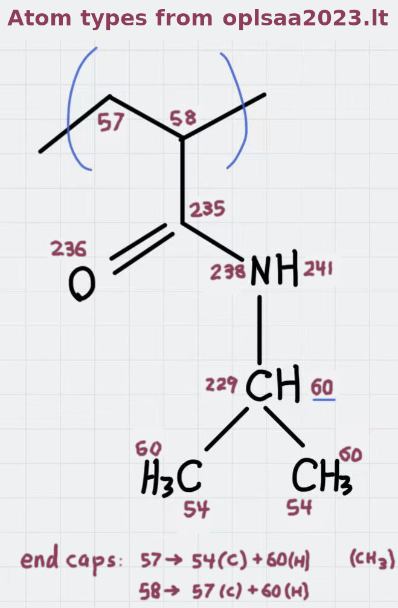

NIPAM polymer in water with ions
==============

 x10   x970     x2

   **LAMMPS**  

### Description

A NIPAM polymer (10mer) immersed in water with Ca++ and Cl- ions
using the *OPLSAA* force field.
In this example, the NIPAM polymer (defined in
[NIPAM_polymer_10mer.lt](./moltemplate_files/NIPAM_polymer_10mer.lt))
was built from 10 "NIPAM_monomer" subunits
(defined in [NIPAM.lt](./moltemplate_files/NIPAM.lt))
and mixed with 970 (SPC/E) water molecules,
one Ca++ ion and two Cl- ions.
The 970 water molecules and 3 ions were initially arranged in an 10x10x10
lattice (with 27 vacancies so the total sums to 10\*10\*10).
The polymer was moved slightly to avoid overlap with the water molecules.
*(Alternatively, I could have usde PACKMOL to create random mixtures
of molecules.)*

The number of molecules, positions, and simulation box size can be
controlled by editing the [system.lt file](moltemplate_files/system.lt).
The simulation contitions can be controlled by editing the
[run_in.npt](run_in.npt) and [run_in.npt](run_in.nvt) files.

## Atom types used

(See the [NIPAM.lt](./moltemplate_files/NIPAM.lt) file for details.)

## Instructions

1) To build the files which LAMMPS needs, follow the instructions in:
[README_setup.sh](README_setup.sh)

2) To run LAMMPS with these files, follow these instructions:
[README_run.sh](README_run.sh)

(The instructions in "README_remove_irrelevant_info.sh" are optional.  *(If you notice a problem with this example, please [report it](../README.md).*)

### Customizing atomic charges

In this example, atomic charge for OPLSAA atoms is determined by @atom type
*(...according to a lookup table located at the beginning of the
["oplsaa2024.lt"](../../../../moltemplate/force_fields/oplsaa2024.lt) file)*.
*(Any atomic charges listed in the "Data Atoms" section of your molecules'
LT files will be ignored.)*
**These charges can be overridden.**
See [here](../README.md#Customizing-atomic-charges-in-OPLSAA-molecules)
for instructions explaining how to customize atomic charge.

### Credit

This example is a modified version of the
NIPAM polymer example created by Axel Kohlmeyer for the
[moltemplate howto documentation](https://docs.lammps.org/Howto_moltemplate.html).
Thanks Axel!
