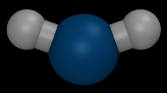
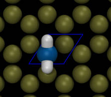
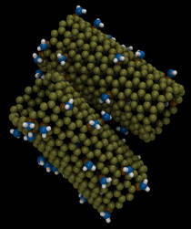

Functionalized Nanotubes
=============================

### Images

        

### Details

This example demonstrates a way to build carbon nanotubes with chemical groups attached to the surface at random locations using moltemplate.  In I used the "new" command with [][] brackets to create a 2-D array of graphene unit cells (blue diamonds) which were wrapped around the surface of a cylinder.

A small fraction of unit cells (selected randomly) have a amine group (NH2) attached to one of the carbon atoms (shown above).  This example uses the "new random" command to select randomly from the two different versions of the graphene unit cell (with and without the attached amine group) when filling the 2-D array, as shown in the pictures above.  *(The "new" and "new random" commands are explained in the moltemplate manual.)*

#### There are no carbon-carbon bonds

In the nanotubes, I did not try to connect the carbon atoms together with bonds.  It is possible to build nanotubes with carbon bonds, but this example does not need them.  Instead, the carbon atoms in the nanotubes are rigid (as well as the nitrogen atoms which are directly bonded to them).  However the nanotubes are allowed to move, as are the remaining atoms in the amine groups (the two hydrogen atoms).

#### Force field parameters

The Lennard-Jones parameters for the carbon atoms were taken from this [paper](https://doi.org/10.1016/S0009-2614(01)01127-7).

The 3 atoms in the amine groups use the OPLSAA force field.  The charge of the carbon they are bonded (colored in orange in the pictures above) is modified so that the local structure (4 atoms) is neutral.  In this simulation, these amine groups were assumed to have no other effect on either the shape or the charge of the nearby carbon atoms in the nanotube.

#### Customizing atomic charges

LAMMPS provides two different methods to specify atomic charges:
1) Specify charges in a DATA file (eg "system.data")
2) Specify them using "set" commands

This is a complicated example because *both* methods were used.
This is because some of the atoms use the OPLSAA force field, and others do not.

1)  Since most of the carbon atoms in the nanotube do *not* use the OPLSAA
force field, their charges are specified in the ordinary way
(ie. in the "Data Atoms" section of the
["graphene.lt"](moltemplate_files/graphene.lt) and
["graphene_nh2.lt"](moltemplate_files/graphene_nh2.lt) files.
*After running moltemplate.sh, the information in the "Data Atoms" section
ends up in the "Atoms" section of the "system.in.data" file created by
moltemplate.sh and read by LAMMPS.*)
2) However NH2 amine group atoms, as well as the \$atom:c1 carbon atoms
in the "Graphene_NH2" object *use the OPLSAA force field*.
Moltemplate's version of the OPLSAA force field assigns atomic charge
according to @atom type, using a lookup table at the beginning of the
["oplsaa.lt"](../../../../moltemplate/force_fields/oplsaa.lt) file.
*(After running moltemplate, this information gets copied into the
"system.in.charges" file created by moltemplate.sh, and read by LAMMPS.)*
So, for these OPLSAA atom types, we never bother to specify their charges in
the "Data Atoms" section.  *(The information in the "system.in.charges"
file overrides it, since LAMMPS reads it after reading the "system.data" file.
See the ["run.in.nvt"](run.in.nvt) file for details.)*
3) The \$atom:c1 carbon in the "Graphene_NH2" object
(defined in ["graphene_nh2.lt"](moltemplate_files/graphene_nh2.lt))
uses the OPLSAA force field.  However it was necessary to customize the
charge of this one atom without changing its type.
Because this atom type belongs to the OPLSAA force field,
in order to modify its charge, we must modify the same file that will
contain the final list of charges for all the OPLSAA atoms:
the "system.in.charges" file.  To do that, we append a
["set" command](https://lammps.sandia.gov/doc/set.html)
to the "In Charges" section at the end of the
["graphene_nh2.lt"](moltemplate_files/graphene_nh2.lt) file.
That "set" command modifies the charge of this individual \$atom:c1 atom.
(Note that any text written to a file named "In XXX" will end up appended
to the end of a file named "system.in.XXX".  In this case, XXX="charges".)

### Requirements

To run this you must have a version of LAMMPS which has been compiled with support for the optional MOLECULE and RIGID packages.  If you encounter errors when running LAMMPS then see [this page](https://lammps.sandia.gov/doc/Build_package.html) for instructions to compile LAMMPS with these packages enabled.

### Notes:

#### Other modeling tools:
If you need explicit bonds between carbon atoms, then you must add them yourself or use a different tool.  Currently (as of 2020-11-30), moltemplate does not generate bonds automatically, although this may change in the future.  The "Nanotube Builder" and "topotools" plugins for for VMD can generate a nanotube with bonds in LAMMPS data format.  You can then convert this data file to .LT format using the ltemplify.py utility and then import it into another .LT file and play with it later.  (In the "cnad-cnt" example, the carbon nanotube was built using "Nanotube Builder" and topotools, and processed with ltemplify.py)

#### Armchair and chiral nanotubes

This is an example of a ["zigzag" nanotube](https://en.wikipedia.org/wiki/Carbon_nanotube#The_zigzag_and_armchair_configurations).  Zigzag nanotubes are easier to build in moltemplate because in a "zigzag" nanotube, the exposed edges at the ends of the nanotube happen to be aligned with the unit cell axes.  If you need to build "armchair" nanotubes or "chiral" *(m,n)* nanotubes, then the ends of the nanotube created using the "new [][]" command will be jagged.  To fix this, you can use moltemplate's "delete" command to remove atoms from the spiky ends of the nanotube.  The "delete" command (and the "new random" command) is discussed in the moltemplate manual.