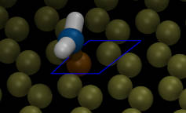

Functionalized Nanotubes
=============================

### Images

         

### Details

This example demonstrates a way to build carbon nanotubes with chemical groups attached to the surface at random locations using moltemplate.  In this example, the carbon nanotubes are 2-D arrays of graphene unit cells which have been wrapped around the surface of a cylinder.  A small fraction of unit cells (selected randomly) have a amine group (NH2) attached to one of the carbon atoms (shown above).  This example uses the "new random" feature to select randomly from the two different versions of the graphene unit cell (with and without the attached amine group), as shown in the pictures above.  The carbon atoms in the nanotubes are rigid (as well as the nitrogen atoms which are directly bonded to them).  However the nanotubes are allowed to move.

#### There are no carbon-carbon bonds

In the graphene and nanotube structures, I did not try to connect the carbon atoms together with bonds.  It is possible to build nanotubes with carbon bonds, but this example does not need them.

#### Force field parameters

The Lennard-Jones parameters for the carbon atoms were taken from this [paper](https://doi.org/10.1016/S0009-2614(01)01127-7).

Although the carbon and nitrogen atoms are rigid, the remaining atoms in the attached amine groups (the two hydrogen atoms) are allowed to move.  The atoms in the amine groups use the OPLSAA force field and modify the charge of the carbon they are bonded to so that the local structure (4 atoms) is neutral.  But in the file I created, the amine groups have no other effect either on the shape or charge of the nearby carbon atoms in the nanotube.  I don't know if this is realistic.

### Requirements

To run this you must have a version of LAMMPS which has been compiled with support for the optional RIGID package. (See the [run.in.nvt](run.in.nvt) file for more details.)  Running at NVT defintely does not require this.

### Notes:

#### Other modeling tools:
If you need explicit bonds between carbon atoms, then you must add them yourself or use a different tool.  Currently (as of 2020-11-30), moltemplate does not generate bonds automatically, although this may change in the future.  The "Nanotube Builder" and "topotools" plugins for for VMD can generate a nanotube with bonds in LAMMPS data format.  You can then convert this data file to .LT format using the ltemplify.py utility and then import it into another .LT file and play with it later.  (In the "cnad-cnt" example, the carbon nanotube was built using "Nanotube Builder" and topotools, and processed with ltemplify.py)
