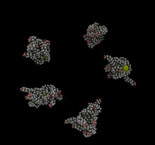

Star Polymer Example
====================
This example is a simple simulation of several star-polymers.  Each star polymer consists of 12 alkane chains (named "Polyethylene16") attached to a large particle located in the center.  *Note: This particular example uses the a variant of the OPLSAA force-field suitable for long alkane chains (sometimes called the "LOPLSAA" force field).*


#### Images

      

   

The number of star molecules and simulation box size can be controlled by editing the [system.lt file](moltemplate_files/system.lt).  The number of polymers in each "star" can be controlled by editing the [polyethylene16_star12.lt](moltemplate_files/polyethylene16_star12.lt) file.  The length of the polymers can be controlled by editing the [polyethylene16.lt](moltemplate_files/polyethylene16.lt) file.  The simulation contitions can be controlled by editing the [run.in.npt file](run.in.npt).


### Instructions

1) To build the files which LAMMPS needs, follow the instructions in:
[README_setup.sh](README_setup.sh)

2) To run LAMMPS with these files, follow these instructions:
[README_run.sh](README_run.sh)

(The instructions in "README_remove_irrelevant_info.sh" are optional.  *(If you notice a problem with this example, please [report it](../README.md).*)


### Details

The "Polyethylene16Star12" molecule, as well as the "Polyethylene16", "CH2", and "CH3" monomers it contains, use the LOPLSAA force-field.  As with all of the OPLSAA examples, when we define these molecules, we only specify the atom names, bond list, and coordinates.  We do not have to list the atom charges, angles, dihedrals, or impropers.  The rules for creating atomic charge and angle topology are contained in the ["loplsaa.lt"](../../../../moltemplate/force_fields/loplsaa.lt) and  ["oplsaa.lt"](../../../../moltemplate/force_fields/oplsaa.lt) files.  To let moltemplate know that you want to use these rules, define your molecules (and molecular subunits) this way:

```
import "loplsaa.lt"
CH2 inherits OPLSAA { ... }                   # (see "ch2group.lt")
CH3 inherits OPLSAA { ... }                   # (see "ch3group.lt")
Polyethylene16 inherits OPLSAA { ... }        # (see "polyethylene16.lt")
Polyethylene16Star12 inherits OPLSAA { ... }  # (see "polyethylene16_star12.lt")
```


#### OPLSAA or LOPLSAA"?

There are only a few differences between LOPLSAA and OPLSAA.  The LOPLSAA force field contains a few extra atom types and dihedral interactions which improve the accuracy of long alkane chains.  The ["loplsaa.lt"](../../../../moltemplate/force_fields/loplsaa.lt) file (referenced above) incorporates these extra atom and dihedral types in the existing OPLSAA force field *instead* of creating a new force field named "LOPLSAA".  *(There is no separate "LOPLSAA" force field object.  I apologize if this is confusing.)*  You can mix LOPLSAA and OPLSAA atoms in the same molecule.


### Manual control of bond and angle interactions

It is unlikely that you will need to do this, but if necessary you can customize existing bonds, angles, dihedrals etc. in your molecule (eg. *Alkane50*), or add new ones (if the force field does not define them).  To do this, edit the corresponding LT file (eg. ["polyethylene16_star12"](./moltemplate_files/polyethylene16_star12.lt)), and add extra sections to that file (eg. *write("Data Bonds")* or *write("Data Angles")*).  Then add a list of bonded interactions to these sections (containing lines similar to *"\$bond:c7h5 @bond:CustomType \$atom:c7 \$atom:h5"*).  By default, this will override the bond and bonded angular interactions created by the force field.  For more details, read the chapter in the moltemplate manual named "Customizing molecule position and topology".)

