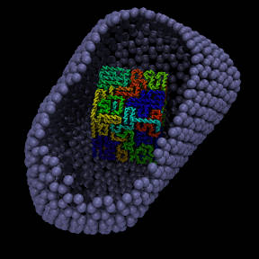

simple confined DNA example
==========

 → 

## Description

This is an example demonstrating how to confine a polymer (eg. DNA)
within an arbitrary shaped box (eg. the HIV viral capsid).
Here are two images showing the initial and final conformation of
the DNA polymer (before and after the simulation).

## Overview

Initially, the conformation of the polymer is created with a combination
of "ndmansfield" (a random self-avoiding-curve generator), smoothed with
"interpolate_curve.py", and then re-scaled so that the spacing between points
along the curve matches the desired spacing between monomers in the polymer.
(See "STEP_1_generate_coords.sh" for details.)

Then the "genpoly_lt.py" tool is used to create a moltemplate file
("dna_polymer.lt") which defines a polymer which lies along the curve
created in step 1 (see above).  The "genpoly_lt.py" program is explained
[here](https://github.com/jewettaij/moltemplate/blob/master/doc/doc_genpoly_lt.md).
Then moltemplate is invoked to create a LAMMPS data file and input script
containing the polymer (as well as the box that it is contained within).
(See "STEP_2_generate_LAMMPS_files.sh" for details.)

Some of the particles in the simulation form the walls of the container
(the viral capsid shell).  The are immobilized by excluding them from
the group of atoms that is supplied to the integrator.  (For details, see
"run.in.min", and pay attention to the "group" and "fix nve/limit" commands.)

##    Prerequisites

LAMMPS must be compiled with the "MOLECULE" AND "USER-MISC" packages enabled.
If you receive this error message (or something similar):
"dihedral_style spherical: Unknown dihedral style", then you must follow
[these instructions](https://lammps.sandia.gov/doc/Build_package.html),
and recompile LAMMPS.

## Details

This example uses the "3bp2p" DNA model described [here](../simple_dna_example).
The force field parameters were tuned to reproduce realistic geometry and
mechanical properties of DNA, including a major/minor groove, helicity, length,
persistence length, and torsional persistence length.

## Polymer Melts (Optional)

Note: In this example, there was only 1 polymer, but you can create a
system with multiple polymers (of various lengths) confined in the same box
by running the "genpoly_lt.py" script with the "-cuts" argument in step 2.
This is a useful way to generate polymer melts.  However if the polymers
in your simulation are long, then their conformation is likely to be
kinetically trapped due to entanglement.  In that case, you must use
one of the following methods below to relax the polymer to its
equilibrium conformation.

## WARNING: THIS IS NOT A REALISTIC MODEL OF DNA IN THE HIV VIRUS

1) It is impossible to equilibrate a long confined polymer using this method.
During the life cycle of an HIV virus (minutes to hours), the DNA
presumably has ample time to rearrange itself into a conformation
which bears similarity to its equilibrium conformation.
However the duration of any computer simulation will be much shorter than that.
The duration of this simulation is insufficient for a polymer
of this length to reach a realistic conformation.
In this example, the DNA is expected to have a liquid-crystal-like
equilibrium conformation, with most of the DNA polymers aligned
parallel to each other.  But in this short simulation, the DNA
remains bent and entangled with itself,
(as you can see in the figure on the upper-right).

In order to reach a plausible equilibrium conformation,
it is necessary to allow the polymer to pass through itself.
In LAMMPS the later can be done using any of the following pair styles:

https://lammps.sandia.gov/doc/pair_fep_soft.html

https://lammps.sandia.gov/doc/pair_table.html

https://lammps.sandia.gov/doc/pair_soft.html

https://lammps.sandia.gov/doc/pair_gauss.html

http://moltemplate.org/lammps_code/pair_lj_charmm_coul_charmm_inter.html
(Search for "soft-core".  Note: This feature requires you to recompile LAMMPS.)

2) In the real HIV virus, DNA is coated with a positively charged protein
("nucleocapsid") which helps compact the DNA.  DNA may also interact with a
different protein (integrase).  Both proteins have been left out of this model.

3) HIV is a retrovirus.  As of 2020-11-30, it is not yet certain whether
the HIV virus contains DNA during any stage of it's lifecycle.
It has been hypothesized the conversion of RNA to DNA in the capsid shell
causes it to burst.  The simulation has been set up to make it easy to
measure the outward force of the DNA on the capsid, however the lack of
nucleocapsid in the simulation makes this an unrealistic model.
(The nucleocapsid protein should reduce the outward pressure of the DNA
on the capsid shell.)

I realize this is a complicated example.
Hopefully in spite of that, this example is useful.

Andrew, 2020-11-30
