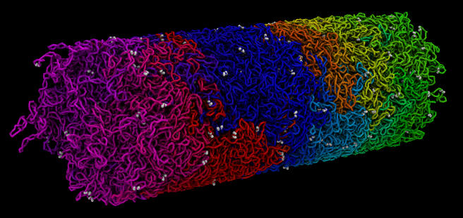
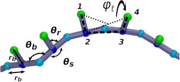
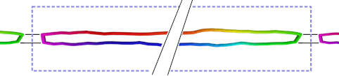
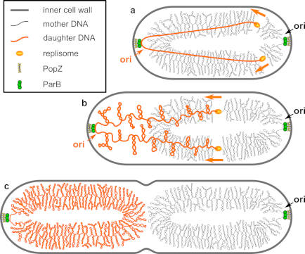

Nucleoid model
=========



## Description

This is an example demonstrating how to build a model of the conformation of
an entire bacterial chromosome (a long circular polymer of DNA), 4Mbp in length
using the coarse-grained "42bp3p" DNA model.  (See details below.)



This simulation was intended to mimic the process of DNA relaxation and
supercoiling during the process of DNA replication in Caulobacter crescentus.

## Summary:

Initially the circular polymer is stretched in a straight-line conformation
connecting opposite ends of the (circular) polymer to opposite ends of a
very long periodic box (to which they are attached).



Twist is applied to polymer to achieve a supercoiled conformation which
mimics the degree of supercoiling measured in bacteria.  In this simulation
this is implemented using hundreds of small motors which exert a torque on
the polymer similar to the torque presumably exerted by the combined effect
replication, transcription, gyrase, and other DNA binding proteins.


The tension is gradually relaxed by shortening the length of the
simulation box until it equals the length of the bacterial cell.
As the box shrinks and the tension in the polymer is reduced,
plectonemic supercoils form, gradually getting longer and more numerous.


## Motivation

This was intended to mimic the process of DNA relaxation after the ParABS
system has pulled the two origins of replication to opposite poles of the cell.
The continued replication of DNA increases the slack and gradually reduces
the tension in the (initially streched) polymer.



During this time, the DNA is supercoiled.
The goal of these simulations is to produce a circular
polymer which is supercoiled in a similar way to the supercoils seen in
bacterial nucleoids. (This simulation neglects to consider many of the important
biological processes which probably also greatly effect the shape of the DNA,
such as DNA-binding proteins ("NAPs"), transcription, and topoisomerases.)

## Implementation

### DNA model (42bp3p)

The earliest description of a DNA model similar to this one that I am aware of
is provided in the appendix of this paper:
F. Benedetti , J. Dorier, Y. Burnier, and A. Stasiak
Nucleic Acids Research (2014) Vol. 42, No. 5, 2848-2855, doi:10.1093/nar/gkt1353

In this variant of the model, each monomer (consisting of 3 particles)
represents 42 base pairs.  (Hence the name "42bp3p")

In this example, moltemplate is used to arrange a coarse grained DNA polymer
into a circle which has been stretched along the X-axis (see below)

```    
    linkers                                             linkers
      |                                                   |
      V                                                   V
     ~~~*--*--*--*--*--*--*--*--*--*--*--*--*--*--*--*--*~~~
        |                                               |
     ~~~*--*--*--*--*--*--*--*--*--*--*--*--*--*--*--*--*~~~
```
Note that this is a periodic simulation.
Linkers (bonds) were added that connect one end of the circle to the
periodic image of the opposite end (on the other side of the periodic boundary).
The length of the simulation box determines how stretched the polymer is.

In this example, several simulations are necessary to create the final model:

1) First we must minimize the system (first half of "STEP_3")
2) Then we can un-stretch the circular DNA (second half of "STEP_3")
by shortening the length of the simulation box.  At the end of this
simulation, the length of the box equals the length of a typical
Caulobacter crescentus cell.
3) In the final simulation, the linkers are removed, and the system is
allowed to relax further.  The topology of the system is now circular:

```    
        *--*--*--*--*--*--*--*--*--*--*--*--*--*--*--*--*
        |                                               |
        *--*--*--*--*--*--*--*--*--*--*--*--*--*--*--*--*
```

### Twist motors

During the simulation, many twist motors (distributed throughout the polymer)
apply a constant torque in order to maintain a
final superhelical density of approximately 0.033 (+/- 0.005).
To implement these "twist motors" this simulation uses an experimental
new feature of LAMMPS called "fix twist".  (See "prerequisites" section.)
(Note: It's not strictly necessary to have this twist motors in the simulation.
 Just initiating the polymer in a twisted conformation also works.
 However using twist motors is much more robust if you later plan to allow the
 polymer to break and/or pass-through itself during the simulation,
 as it does in the living cell.)

## Prerequisites

LAMMPS must be compiled with the "MOLECULE" AND "USER-MISC" packages enabled.
(https://lammps.sandia.gov/doc/Build_package.html)

It also requires that the "fix twist" feature has been enabled in LAMMPS.
(As of 2019-5-05, you must download "fix_twist.cpp" and "fix_twist.h" from
 https://github.com/jewettaij/lammps/tree/fix_twist/src/USER-MISC
 and copy those 2 files into the "src/" subdirectory of our LAMMPS folder,
 and re-compile LAMMPS.  Hopefully in the future this won't be necessary.)

After enabling the packages you need (and, if necessary copying the
"fix_twist.cpp" and "fix_twist.h" files), you must (re)compile LAMMPS
to enable the features that this example uses.

If, when running LAMMPS, you receive this error message
"Unknown dihedral style", "Unknown fix", or something similar,
it means you did not successfully follow the instructions above.


## How to run the simulation

The sequence of steps to follow is explained in files whose names begin with
"STEP".  These files contain commands (written in the "BASH" shell script
language) as well as extensive (and hopefully up-to-date) comments explaining
what is going on.  The files beginning with "STEP" and ending with ".sh" can
be run as executable files, by entering them into the shell.  For example,
just enter them into the terminal, as shown below:

   ./STEP_1_generate_coords.sh
   ./STEP_2_generate_LAMMPS_files.sh

(You don't actually have to read these files.)
However you will actually need to read the instructions in steps 3 and 5.
Read the instructions in "STEP_3_run_sim_contract.sh", and modify them,
taking into consideration the name of the LAMMPS binary (eg "lmp_mpi")
on your computer system, as well as the number of CPU cores available to you.

After STEP_3, run the following script in the shell:

   ./STEP_4_delete_link_bonds_from_data_file.sh

This will create a new LAMMPS DATA/topology file with the linker bonds deleted.

Finally, read and follow the instructions in "STEP_5_run_sim_break_links.sh".
(As in STEP_3, you may need to modify the procedure slightly for your hardware.)

At this point, the conformation of the polymer should have (hopefully)
relaxed into a realistic circular chromosome conformation.

### Running time:

This is a large system that is run over a very long number of iterations,
and takes about a week on a computer with 40 CPU cores.
(Since most of the force-field styles used support GPU acceleration, this could
 probably be much faster if GPUs were used.  But I have not tried this yet.)

If time is an issue, moderately reasonable results can still be obtained by
running the simulations for up to 10 times faster.  To do this, edit the
"run.in.contract" file and modify the "run" and "fix langevin" commands to
reduce the running times and Langevin damping times by the same factor (eg 10).

(If run sufficiently slowly, the speed of the contraction should not have
an effect the final chromosome shape.  Our goal in this example was to
create a chromosome shape in this long-time, slow-relaxation limit.)