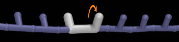

Twist Motors acting on DNA
====================

This example demonstrates how to prepare a simulation of circular
double-stranded (ds) DNA containing a "twist motor"
(a machine that applies a torsional torque on the polymer).

In biology, machines like gyrase cause double stranded breaks
allowing the polymer to pass through itself at times that would
preferentially generate a negative supercoiling density throughout the DNA.
These machines have the effect of twisting the DNA.
In this example, "twist motors" are implemented in a much more simple way
as rotary motors.
There are two types of rotary motors implemented:

1) Motors that apply a constant torque to the polymer
https://www.youtube.com/watch?v=tnhUKxsAaqw

2) Motors that twist at a constant rate
https://www.youtube.com/watch?v=xU2QzDDmuyA

Note: The polymer shown in those videos ("3bp2p") is different than the
      polymer used in this example ("42bp3p"), however the behavior
      of the twist motors is the same.

##    Prerequisites

LAMMPS must be compiled with the "MOLECULE" AND "USER-MISC" packages enabled.
(https://lammps.sandia.gov/doc/Build_package.html)

It also requires that the "fix twist" feature has been enabled in LAMMPS.
(As of 2019-5-05, you must download "fix_twist.cpp" and "fix_twist.h" from
 https://github.com/jewettaij/lammps/tree/fix_twist/src/USER-MISC
 and copy those 2 files into the "src/" subdirectory of our LAMMPS folder,
 and re-compile LAMMPS.  Hopefully in the future this won't be necessary.)

After enabling the packages you need (and, if necessary copying the
"fix_twist.cpp" and "fix_twist.h" files), you must (re)compile LAMMPS
to enable the features that this example uses.

If, when running LAMMPS, you receive this error message
"Unknown dihedral style", "Unknown fix", or something similar,
it means you did not successfully follow the instructions above.

##    WARNING

These files (originally uploaded on 2019-12-10) contain many comments
(beginning with "#") which are probably misleading and no longer relevant.
I will try to clean up these files over time.
Please let me know if anything doesn't work.

##    Instructions

Instructions on how to build LAMMPS input files and 
run a short simulation are provided below

The following file contain instructions explaining how to generate
the curve that you want the DNA polymer to follow.
(You can also run it as an executable.)

   ./STEP_1_generate_initial_path.sh

The next file explains how to convert this curve into a moltemplate file, and
how to run moltemplate on that file. (You can also run it as an executable.)

   ./STEP_2_generate_LAMMPS_files.sh

Finally, to run the LAMMPS simulation follow the instructions in this file:
STEP_3_run_sim.sh
You will have to edit the file to specify the name of the LAMMPS binary
you are using (for example, "lmp_ubuntu"), and the number of processors

Note that the simulation was run without using a thermostat,
so there is no random thermal motion in this simulation.
(This can easily be switched on by editing the "run.in" file.)