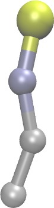
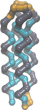
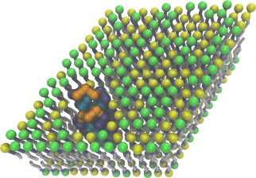
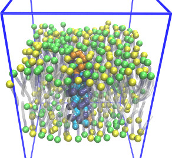

Coarse grained membrane protein
=======================================
This example shows how to put a protein (inclusion) in a lipid bilayer mixture composed of two different lipids (DPPC and DLPC).  The protein and lipid models come from different papers which were published years apart and were not originally designed to be combined together in the same simulation.  (See details below.)  The purpose of this example is to demonstrate how one might combine different kinds of coarse-grained models together.

### Images

         

### Strategy
First, a hexagonal array of lipids is created.  Some of these lipids are deleted and a protein is inserted.  Rectangular periodic boundary conditions are applied, and the system is equilibrated at zero tension and constant temperature.  To change the composition of the membrane, edit the [system.lt](moltemplate_files/system.lt) file.  To change the simulation conditions, edit the [run.in.npt](run.in.npt) file.

### Prerequisites

1) This example requires custom features to be added to LAMMPS, which usually require LAMMPS to be compiled from source code.  If you encounter the error *"Invalid pair_style"*, then you must add these features to LAMMPS.  To do that:
a) Download the LAMMPS source code (if you have not yet done so), either from https://lammps.sandia.gov/download.html, or using *"git clone https://github.com/lammps/lammps ~/lammps_src"*
b) download the "additional_lammps_code" from http://moltemplate.org (upper-left corner menu)
c) unpack it
d) copy the .cpp and .h files to the src folding of your lammps installation.
e) (re)compile LAMMPS.

2) This example uses "dihedral_style fourier" which requires a version of LAMMPS compiled with support for the optional "EXTRA-MOLECULE" package.  If you encounter the error *"Invalid dihedral_style"*, then see [this page](https://docs.lammps.org/Build_package.html) for instructions to compile LAMMPS to support this package.

### Instructions

More detailed instructions on how to build LAMMPS input files and run a short simulation are provided in other README files.

1) To build the files which LAMMPS needs, follow the instructions in:
[README_setup.sh](README_setup.sh)

2) To run LAMMPS with these files, follow these instructions:
[README_run.sh](README_run.sh)

### Details

This example contains a coarse-grained model of a 4-helix bundle protein inserted into a lipid bilayer (made from a mixture of DPPC and DLPC).

#### Protein Model

The coarse-grained protein is described in:
G. Bellesia, AI Jewett, and J-E Shea, Protein Science, Vol19 141-154 (2010)
Here we use the "AUF2" model described in that paper.  (In the paper, the protein is soluble and the hydrophobic beads face inwards.  In this simulation, the protein is embedded in a lipid bilayer and the hydrophobic beads face outwards towards the lipids.)

#### Memebrane Model

The DPPC lipid bilayer described in:
1) G. Brannigan, P.F. Philips, and F.L.H. Brown, Physical Review E, Vol 72, 011915 (2005)
2) M.C. Watson, E.S. Penev, P.M. Welch, and F.L.H. Brown, J. Chem. Phys. 135, 244701 (2011)

As in Watson(JCP 2011), rigid bond-length constraints, have been replaced by harmonic bonds.

A truncated version of this lipid (named "DLPC") has also been added.  The bending stiffness of each lipid has been increased to compensate for the additional disorder resulting from mixing two different types of lipids together.  (Otherwise pores appear.) Unlike the original "DPPC" molecule model, the new "DPPC" and "DLPC" models have not been carefully parameterized to reproduce the correct behavior in a lipid bilayer mixture.

#### Known issues
This is not an ideal coarse grained lipid mixture.  Simulations of small liposomes with high curvature have shown that the the DPPC model at 300K is likely crystalize and phase separate from the DLPC model lipids.

For more a variant of this model with somewhat more realistic behavior, see the "membrane+protein_vesicle_Br2005+Be2010" example.
