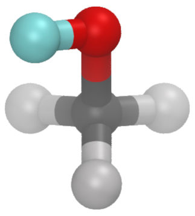
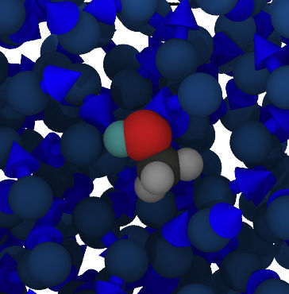

ELBA water + all-atom solute
=========
The purpose of this example is to demonstrate how to combine different molecules
using radically different pair pair styles together in the same simulation
(using moltemplate).

#### Images

     

This is an example of a single all-atom methanol molecule
immersed in coarse grained ELBA water.
In this example, the initial positions of the molecules
were randomly generated by PACKMOL.
Since PACKMOL does not know anything about dipoles, initially all of the
dipoles are pointing in the +x direction,
but they will point in random directions after reaching equilibrium
during a short LAMMPS simulation at room temperature.

This example was provided by Oscar Matus Rivas at McGill University.

### Instructions 
More detailed instructions on how to build LAMMPS input files and
run a short simulation are provided in other README files.

### Step 1) README_setup.sh
This file explains how to use moltemplate.sh to build the files that
LAMMPS needs.

### Step 2) README_run.sh
This file explains how to use LAMMPS to run a simulation using the
files you created in step 1.

### Prerequisites

This example requires that LAMMPS was built with the "DIPOLE" package.
If lammps complains of a missing pair style, you will have to recompile
LAMMPS with the "DIPOLE" package enabled.
For details see:
https://docs.lammps.org/Build_package.html

### References:

1) Orsi, Mario, Wei Ding, and Michail Palaiokostas. "Direct mixing of atomistic solutes and coarse-grained water." Journal of chemical theory and computation 10.10 (2014): 4684-4693.

2) Orsi, Mario. "Comparative assessment of the ELBA coarse-grained model for water." Molecular Physics 112.11 (2014): 1566-1576.

3)  ELBA coarse-grained water model tutorial: 
https://github.com/orsim/elba-lammps/tree/master/examples/water-bulk
